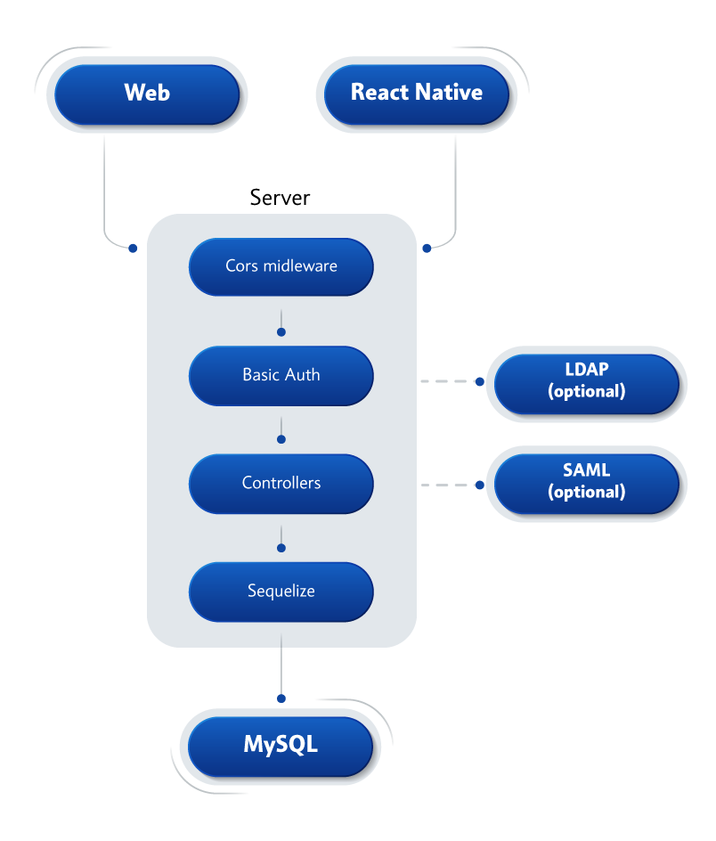
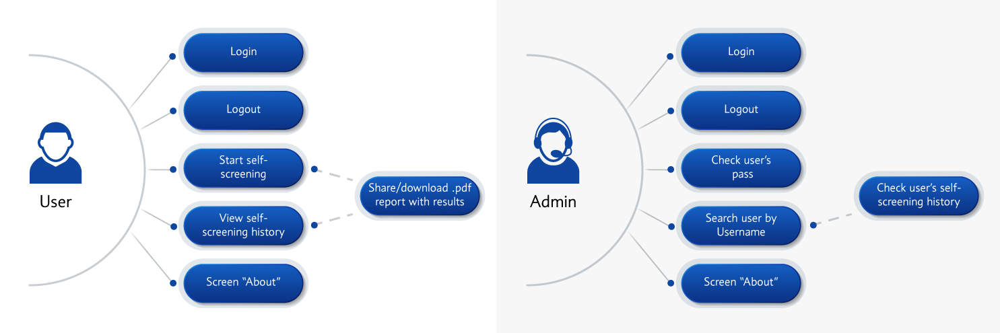

# Workhealth
The Workhealth app was designed to help medical specialists timely identify any warning health-related symptoms and notify the manager before starting a work shift. In this way, the application contributes to the mitigation and prevention of the disease spread and helps medical facilities keep their employees and patients healthy. When a user opens the app, they will see a survey with health-related questions. Based on the user’s answers, the application will determine whether the user can attend work or whether they should seek medical help. If the user is allowed for work, they will receive a unique one-day code that they should present to the security guard or administrator upon arriving at work. The codes are generated on a daily basis and thus cannot be used repeatedly. This prevents employees from skipping the survey and encourages them to closely monitor their health state.
# Tech Stack
### Frontend, Mobile application
- [React](https://github.com/facebook/react) / [React Native](https://facebook.github.io/react-native/)
- [React Navigation](https://github.com/react-community/react-navigation)
- [Redux](https://redux.js.org/)
- [Redux-Persist](https://github.com/rt2zz/redux-persist)
### Backend
- [Express](https://github.com/expressjs/express)
- [Sequelize](https://github.com/sequelize/sequelize) 
- [Swagger](https://github.com/swagger-api/swagger-node)
# Architecture

# Use case diagram

# Contact information
<info@softteco.com>
# License
This code is distributed under the terms and conditions of the [MIT](LICENSE)
